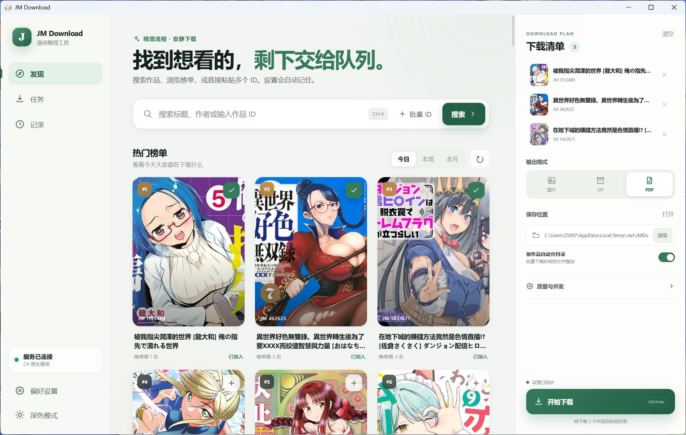

<div align="center">

# JM Download

**找到想看的，剩下交给队列。**

一个面向 Windows 的 JMComic 桌面下载工具，提供搜索、榜单、批量队列、记录管理与多格式输出。


</div>

## 界面预览



界面采用与程序一致的低饱和绿色主题，以搜索、选择、队列和下载为主线，常用操作集中在一个工作区内完成。

## 主要功能

| 模块 | 功能 |
| --- | --- |
| **搜索** | 按标题、作者或作品 ID 搜索，支持时间筛选与结果排序 |
| **榜单** | 浏览日榜、周榜和月榜，刷新时保留当前选择 |
| **批量选择** | 从搜索结果或榜单中加入多个作品，也可直接粘贴多个 ID |
| **下载队列** | 展示等待、运行、完成与失败状态，下载过程中局部更新列表 |
| **输出格式** | 支持图片目录、ZIP 和 PDF |
| **资源复用** | 已存在的图片、ZIP 或 PDF 可直接转换，减少重复下载 |
| **任务记录** | 查看历史任务、输出位置和执行结果 |
| **外观设置** | 支持浅色与深色模式，设置会自动保存 |

### 搜索筛选与排序

- 时间范围：全部、今天、本周、本月
- 排序方式：相关度、最新、浏览量、页数、收藏量
- 支持普通关键词、作品 ID 与批量 ID

### 下载与输出

- 多作品批量下载
- 按作品自动创建目录
- 图片后缀转换
- ZIP 打包
- PDF 合并或按章节导出
- 下载并发与图片并发设置
- 已有目标格式自动识别

## 下载使用

前往项目的 [**Releases**](https://github.com/yxxawa/jmDownload/releases/latest) 页面，根据设备架构选择：

| 设备 | 文件 |
| --- | --- |
| 常见 Intel / AMD Windows 电脑 | `JMDownload-win-x64.exe` |
| Windows on ARM 设备 | `JMDownload-win-arm64.exe` |

下载后直接运行单文件 EXE。

### 运行环境

发布版采用自包含方式，`.NET 9 Desktop Runtime` 已包含在 EXE 中。

程序使用系统安装的 **Microsoft Edge WebView2 Evergreen Runtime** 显示界面，发布包不携带 WebView2 浏览器运行时。Windows 11 以及多数较新的 Windows 10 环境通常已经安装该组件。

## 基本流程

1. 在搜索框输入标题、作者或作品 ID。
2. 使用筛选和排序缩小结果范围。
3. 点击卡片右上角按钮，将作品加入右侧下载清单。
4. 选择图片、ZIP 或 PDF 输出格式。
5. 设置保存位置和并发参数。
6. 点击 **开始下载**，在任务页查看实时进度。

快捷键：

| 快捷键 | 操作 |
| --- | --- |
| `Ctrl + K` | 聚焦搜索框 |
| `Ctrl + Enter` | 开始下载 |

## 数据位置

| 数据 | 默认位置 |
| --- | --- |
| 下载内容 | EXE 所在目录下的 `JMDownLoad` |
| 用户设置 | `%LOCALAPPDATA%\JMComicDesktop\config.json` |
| WebView2 用户数据 | `%LOCALAPPDATA%\JMComicDesktop\WebView2` |
| 下载索引 | 下载目录中的 `.jmdownload_index.json` |

保存位置可在程序右侧面板中随时修改。

## 本地构建

需要：

- Windows
- .NET 9 SDK
- Microsoft Edge WebView2 Runtime

```powershell
dotnet restore
dotnet build DesktopShell.csproj -c Release
dotnet run --project DesktopShell.csproj
```

## 发布单文件 EXE

项目已内置单文件发布参数。WebView2 Evergreen Runtime 保持为系统组件，不写入发布包。

```powershell
# Windows x64
dotnet publish DesktopShell.csproj `
  -c Release `
  -r win-x64 `
  -o artifacts/single-file/win-x64

# Windows ARM64
dotnet publish DesktopShell.csproj `
  -c Release `
  -r win-arm64 `
  -o artifacts/single-file/win-arm64
```

发布参数包括：

- 自包含 .NET 9 Desktop Runtime
- 单文件输出
- 单文件压缩
- 按目标架构包含必要的原生加载组件
- 外部使用系统 WebView2 Evergreen Runtime
- 保留完整 WPF 与 WebView2 托管调用，关闭裁剪以保证稳定性

## 项目结构

```text
jmDownload/
├── assets/
│   └── app-preview.png           README 界面预览
├── frontend/
│   ├── index.html                页面结构
│   ├── styles.css                主题与布局
│   └── app.js                    前端状态与交互
├── NativeBackend/
│   ├── JmClient.cs               API 与数据请求
│   ├── NativeDownloadManager.cs  队列和下载流程
│   ├── ArtifactTools.cs          ZIP / PDF / 图片处理
│   └── AppConfigStore.cs         设置持久化
├── MainWindow.xaml               WPF 桌面窗口
├── MainWindow.xaml.cs            WebView2 生命周期
└── DesktopShell.csproj           项目与发布配置
```

## 技术结构

```text
WPF Desktop Shell
        │
        ├── WebView2 UI
        │       └── HTML / CSS / JavaScript
        │
        └── C# Native Backend
                ├── Local HTTP API
                ├── Search & Ranking
                ├── Download Queue
                └── Image / ZIP / PDF Pipeline
```

前端资源以嵌入资源形式随程序发布，后端、下载器与格式处理均由 C# 实现。

## 说明

本项目用于技术交流与个人工具开发。下载内容的相关权利归原作者及对应平台所有，请遵守所在地规则与平台条款。
