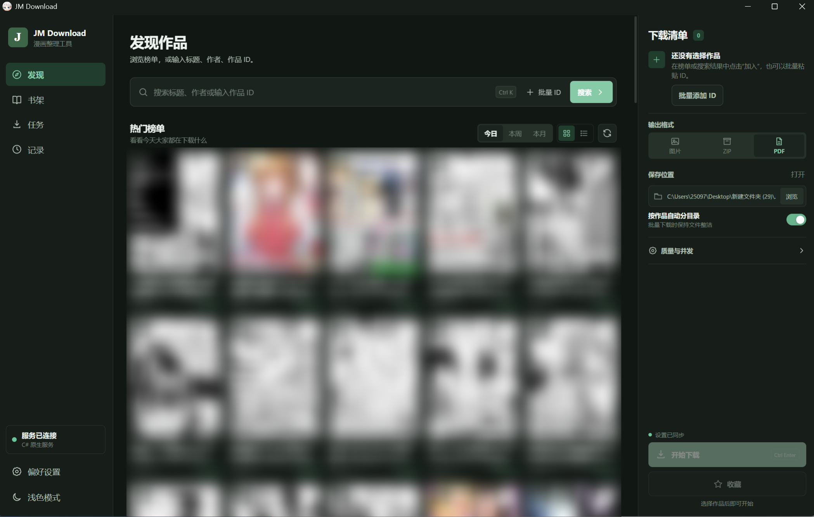

# JM Download

**JM Download** 是一款面向 Windows 的漫画检索、整理、下载与在线阅读桌面程序。桌面外壳使用 WPF，工作区使用 WebView2，应用本地后端使用 C#/.NET 实现。



> 本项目为独立第三方工具，与相关内容平台无隶属或官方合作关系。程序不会托管漫画内容；访问、下载或保存内容前，请确认你有权这样做，并遵守所在地法律及相关平台条款。

## 功能

### 发现与管理

- 关键词搜索、作品 ID 搜索和排行榜浏览。
- 作品详情、封面、作者、章节与标签展示。
- 下载队列、任务进度、取消/停止、任务排序。
- 导出为图片目录、ZIP 或 PDF；可配置图片格式和 PDF 组织方式。
- 下载目录、并发数和界面偏好保存在本机。
- 作品详情收藏、下载清单批量收藏，以及各记录列表的选择、全选和批量移除。

### 在线阅读

- 从作品详情打开阅读器；支持竖向滚动、单页和双页模式。
- 支持章节目录、上一页/下一页、上一章/下一章、页码跳转和进度滑块。
- 阅读方向、页面适配、缩放、明暗主题、专注模式与全屏。
- 书架、收藏、书签、阅读进度和阅读设置持久化保存。
- 按需加载章节；邻近图片预读、图片缓存上限设置、失败页面重试。
- 阅读器可将已下载完成的本地作品加入本地书架。

版本更新与验证步骤见 [`docs/CHANGELOG.md`](docs/CHANGELOG.md)。

## 运行要求

- Windows 10/11 x64 或 Windows on ARM64。
- Microsoft Edge **WebView2 Runtime**。应用使用 Evergreen Runtime；如果目标设备没有该运行时，请先安装 WebView2 Runtime。
- 开发构建需要 .NET SDK 9 和 Windows 桌面开发组件。发布版通过 `dotnet publish` 自包含发布 .NET，不要求用户另外安装 .NET Runtime。

**版本提示：** 当前项目目标框架为 `net9.0-windows`。截至 2026-10-01，.NET 9 的官方支持结束日期为 **2026-11-10**。维护者发布新版本前应评估迁移到受支持的目标框架；迁移前请勿把本仓库的当前目标框架描述为长期支持版本。

## 获取构建产物

仓库中的 GitHub Actions 工作流会在 `main`/`master` 分支推送、Pull Request 或手动触发时构建并自检 Windows x64 与 ARM64 版本。成功运行后，可从对应工作流运行页面下载构建产物：

| 设备 | Actions 产物名称 | 包内可执行文件 |
| --- | --- | --- |
| 常见 Intel / AMD Windows 电脑 | `JMDownload-win-x64` | `DesktopShell.exe` |
| Windows on ARM64 | `JMDownload-win-arm64` | `DesktopShell.exe` |

该工作流上传的是 Actions 构建产物，不会自动创建 GitHub Release。维护者如需发布正式版本，应先完成人工检查，再将对应程序包附加到 GitHub Release。首次运行时仍需要系统中的 WebView2 Runtime。开发者也可使用下文的发布脚本在本机生成程序包。

## 从源码构建

先安装 .NET SDK 9，然后在仓库根目录运行：

```powershell
./scripts/build.ps1
```

也可以直接使用 .NET CLI：

```powershell
dotnet restore .\DesktopShell.csproj
dotnet build .\DesktopShell.csproj -c Release -p:SmokeTest=false
```

运行桌面应用：

```powershell
dotnet run --project .\DesktopShell.csproj -c Release -p:SmokeTest=false
```

> **重要：** 桌面 GUI 构建应使用 `SmokeTest=false`（脚本已固定传入）。`SmokeTest=true` 会切换到后端冒烟测试入口，该模式会启动后端并在测试结束后退出，不会显示桌面窗口。不要将 SmokeTest 构建产物当作 GUI 发布。

## 发布单文件程序

在 Windows 上执行：

```powershell
./scripts/publish.ps1 -RuntimeIdentifier win-x64
./scripts/publish.ps1 -RuntimeIdentifier win-arm64
```

发布目录默认为 `release/<RID>/`。等价 CLI 命令：

```powershell
dotnet publish .\DesktopShell.csproj `
  -c Release `
  -r win-x64 `
  -p:SmokeTest=false `
  -o .\release\win-x64
```

ARM64 构建时将 `win-x64` 改为 `win-arm64`。程序包包含对应架构的 .NET 运行时与应用依赖；WebView2 Evergreen Runtime 仍由目标设备提供。

## 运行打包自检

自检验证发布程序内的前端资源、阅读器 API 身份验证及阅读器初始状态，不打开 GUI，也不向上游站点发送请求：

```powershell
./scripts/selfcheck.ps1 -ExecutablePath .\release\win-x64\DesktopShell.exe
```

也可直接运行：

```powershell
.\release\win-x64\DesktopShell.exe --selfcheck .\artifacts\selfcheck.json
```

成功时进程退出码为 `0`，报告中的 `result` 为 `PASS`。此外，`NativeBackendSmoke.cs` 提供后端和本地文件导出冒烟测试；它与上述发布包自检用途不同，详细说明见 [`docs/DEVELOPMENT.md`](docs/DEVELOPMENT.md)。

## 项目结构

```text
.
├── .github/workflows/       # Windows x64/ARM64 CI 与发布产物
├── assets/                  # README 预览图等静态素材
├── docs/                    # 架构、开发与发布说明
├── frontend/
│   ├── index.html           # 工作区结构与阅读器 DOM
│   ├── styles.css           # 主界面主题与布局
│   ├── app.js               # 搜索、作品详情、下载队列与书架交互
│   ├── reader.js            # 在线阅读器状态和交互
│   └── reader.css           # 阅读器布局和主题
├── NativeBackend/
│   ├── NativeBackendServer.cs # 回环 HTTP/WebSocket 服务与 API 路由
│   ├── JmClient.cs            # 上游请求、作品数据与图片地址
│   ├── ReaderService.cs       # 阅读会话、章节加载与预读
│   ├── ReaderStore.cs         # 书架、进度、书签和设置持久化
│   ├── ImageRepository.cs     # 阅读/封面图片缓存与读取
│   ├── NativeDownloadManager.cs # 下载队列和任务状态
│   └── ArtifactTools.cs       # 图片、ZIP、PDF 等文件处理
├── scripts/                  # 可重复的构建、发布、自检命令
├── App.xaml                  # WPF 应用入口与资源
├── MainWindow.xaml           # 桌面窗口
├── MainWindow.xaml.cs        # 后端与 WebView2 生命周期
├── DesktopBridge.cs          # 桌面文件选择等桥接
├── WebViewBridge.cs          # WebView2 初始化与本地 API 授权
├── NativeBackendSmoke.cs     # 可选后端/文件导出冒烟测试入口
└── DesktopShell.csproj       # WPF、资源嵌入与发布配置
```

更完整的组件关系与本地 API 说明见 [`docs/ARCHITECTURE.md`](docs/ARCHITECTURE.md)。贡献前请阅读 [`CONTRIBUTING.md`](CONTRIBUTING.md)。

## 本地数据与隐私

应用默认将设置、缓存与阅读数据写入当前 Windows 用户的本地应用数据目录：

```text
%LOCALAPPDATA%\JMComicDesktop\
```

其中包含配置、缓存节点信息、阅读进度/书架/书签/设置，以及 WebView2 用户数据。下载文件默认写入应用目录下的 `JMDownLoad`，用户可以在应用中更改目录。不要将个人配置、浏览器数据、访问令牌或下载内容提交到 Git 仓库。

本地后端仅绑定到 `127.0.0.1` 的动态端口，并为会话生成随机令牌；不要将此本地服务改为监听公网网卡，也不要在 issue、日志或截图中公开令牌和个人数据。

## 开源许可与发布前检查

当前源码快照**没有附带 LICENSE 文件**。GitHub 仓库设为公开并不自动授予他人复制、修改或再分发代码的许可。发布前请确认你对所有源码、图标和预览图拥有相应权利，并选择适合的许可证；在许可证确定前，不要声称本项目使用 MIT 或其他许可证。也请复核上游 API 使用方式、相关服务条款和内容版权要求。检查清单见 [`docs/RELEASE_CHECKLIST.md`](docs/RELEASE_CHECKLIST.md)。

## 致谢

- Microsoft .NET、WPF 与 WebView2。
- SkiaSharp 用于桌面端 WebP 处理；许可与依赖说明见 [`docs/THIRD_PARTY_NOTICES.txt`](docs/THIRD_PARTY_NOTICES.txt)。
- 本项目使用的第三方 NuGet 包及其许可证信息见项目文件与各包的上游说明。

---

English summary: JM Download is a Windows desktop application for comic discovery, downloads, library management, and online reading, built with WPF, WebView2, and a C# local backend.